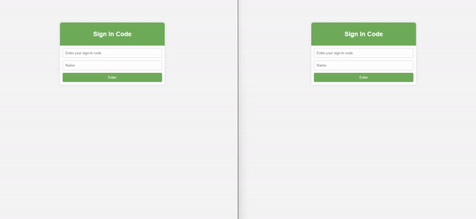

# Django-WebSocket-Chat


[](https://www.python.org/downloads/release/python-311/)
[](https://docs.djangoproject.com/en/5.0/releases/5.0.1/)
[](https://python-poetry.org/docs/)

Real-time chatting application built with Django and WebSocket, featuring 24-hour data retention and the creation of chat rooms using random codes.

## Usage



## How to Locally Run the Project

Make sure you have Python 3.8 or higher installed. Install Poetry for managing the project's virtual environment.

```bash
# Install Poetry (if not already installed)
pip install poetry

# Install project dependencies
poetry install

# Activate the virtual environment
poetry shell

# Apply migrations
poetry run python manage.py migrate

# Run the development server
poetry run python manage.py runserver

```

## Contributions

Contributions are welcome! Feel free to create pull requests. 

## License

This project is licensed under the [MIT License](LICENSE) - see the [LICENSE](LICENSE) file for details.

